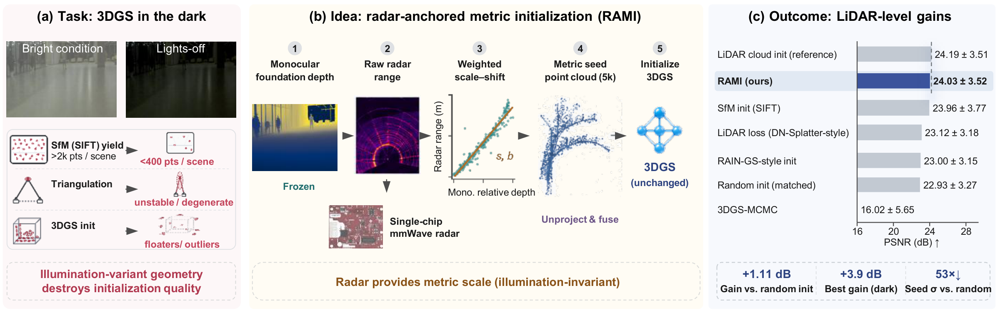
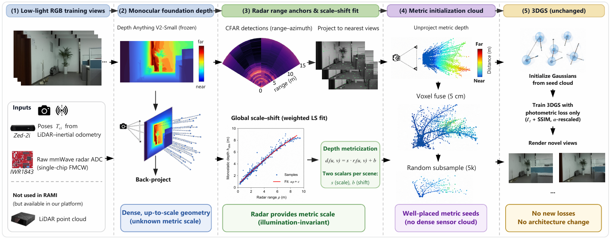

<p align="center">
  <h1 align="center">Radar-Anchored Metric Initialization for 3D Gaussian Splatting<br>under Suboptimal Illumination</h1>
  <p align="center">
    <a href="https://ruixv.github.io/RAMI/"></a>
    
    
  </p>
</p>

<p align="center">
  
</p>

**RAMI** (Radar-Anchored Metric Initialization) seeds 3D Gaussian Splatting with metric geometry in the one place where sensor geometry cannot conflict with photometric optimization: the initial point cloud. A frozen monocular foundation model provides relative depth; a **single per-scene weighted scale–shift fit (two scalars)** against raw single-chip mmWave radar ranges lifts it to metric scale; the fused 5k-point seed enters an otherwise **unchanged** 3DGS pipeline. No new losses, no trainable components, no architecture changes.

## Highlights

- **+1.11 dB PSNR** on average over matched random initialization across a 23-scene, 5,946-frame real indoor benchmark (bright to lights-off), positive on 21/23 scenes, under a strict training-frames-only protocol.
- **Matches a raw LiDAR-cloud initialization** (24.03 vs. 24.19 dB) using a commodity single-chip radar, and leads it in the dark tier (27.26 vs. 27.23 dB).
- **Reliability, not just the mean**: worst case −0.22 dB (on a saturated capture), and seed-to-seed standard deviation reduced from 1.59 dB to 0.03 dB.
- **Evidence for the injection point**: across every supervision mechanism we tested, attaching the same geometry as a loss helps unpredictably, and its benefit is uncorrelated with geometric fidelity. Injected once as the seed, it is reliably positive.

## Method

<p align="center">
  
</p>

1. **Inputs**: low-light RGB, odometry poses, raw radar ADC (LiDAR is *not* used by RAMI).
2. **Monocular foundation depth**: a frozen Depth Anything V2-Small gives up-to-scale relative depth.
3. **Radar anchors and scale–shift fit**: CFAR detections projected into training views supply one weighted least-squares fit per scene, the radar's sole role.
4. **Metric seed cloud**: metric depths are unprojected, voxel-fused, and subsampled to 5k points.
5. **3DGS, unchanged**: the seed enters the standard pipeline; training and rendering are bit-identical to the baseline.

## Results

Comparison with recent pipelines on all 23 benchmark scenes (mean over scenes; strict training-frames-only protocol; **bold** best, *italic* second best):

| Method | PSNR↑ | SSIM↑ | LPIPS↓ | Dark↑ | Dim↑ | Bright↑ | Worst Δ / #fail |
|---|---|---|---|---|---|---|---|
| 3DGS (random init) | 22.93 | 0.757 | 0.549 | 25.88 | 21.17 | 23.86 | — |
| + SLV init (RAIN-GS-style) | 23.00 | 0.759 | 0.554 | 25.75 | 21.23 | 24.06 | −2.49 / 11 |
| + per-view tone curves (Luminance-GS-style) | 20.61 | 0.721 | 0.564 | 22.68 | 19.65 | 20.90 | −11.26 / 22 |
| 3DGS-MCMC | 16.02 | 0.400 | 0.711 | 17.14 | 15.90 | 15.62 | −19.98 / 18 |
| DN-Splatter-style (LiDAR loss) | 23.12 | 0.757 | 0.530 | 26.39 | 21.37 | 23.89 | −1.58 / 10 |
| 3DGS + feed-forward init (DUSt3R/InstantSplat-style) | 23.14 | 0.762 | 0.554 | 26.88 | 20.99 | 24.23 | −2.09 / 13 |
| 3DGS + SfM-points init | 23.96 | 0.773 | 0.529 | 27.15 | 22.15 | *24.86* | −1.01 / 5 |
| 3DGS + LiDAR-cloud init | **24.19** | **0.776** | **0.523** | *27.23* | **22.38** | **25.15** | *−0.55 / 2* |
| **RAMI (ours, radar init)** | *24.03* | *0.774* | *0.526* | **27.26** | *22.27* | 24.84 | **−0.22 / 2** |

More results, videos, and interactive comparisons on the [project page](https://ruixv.github.io/RAMI/).

## Installation

```bash
conda create -n rami python=3.10 -y && conda activate rami
pip install torch==2.4.0 --index-url https://download.pytorch.org/whl/cu121
pip install -r requirements.txt
```

Tested stack: Python 3.10, PyTorch 2.4.0 + CUDA 12.1, gsplat 1.5.3 on a V100; see [ENVIRONMENT.md](ENVIRONMENT.md). gsplat JIT-compiles its CUDA kernels on first use and needs a CUDA-compatible host compiler. Two model weights download automatically on first run (Depth Anything V2-Small, LPIPS AlexNet).

## Quick Start

Point `RAMI_DATA_ROOT` at a directory containing the raw capture folders listed in `configs/scenes.json` (an external directory is recommended; it defaults to `./data`, which also hosts the loader package). All intermediate and final artifacts go to `./outputs/`.

Three entry scripts, one scene at a time (`dark401a` is a small 180-frame scene, good for a first run):

```bash
# 1. Preprocess: canonical GT export + RAMI seed cloud + SfM control cloud
scripts/run_preprocess.sh dark401a 0        # <scene_tag> [gpu_id]

# 2. Train one arm: rami | sfm | random
scripts/run_train.sh dark401a rami 0

# 3. Render held-out views, score against clean GT, print the aggregate table
scripts/run_eval.sh dark401a rami 0
```

Expected outputs:

- `outputs/canonical_gt/<tag>/` -- clean GT images + `splits.json` (every 8th frame held out)
- `outputs/anchored_depth/<tag>_initcloud_trainfit.npy` -- the RAMI 5k seed cloud (the exact per-scene clouds used in the paper ship in `assets/seeds/*.ply`)
- `outputs/runs/<tag>_<arm>/` -- checkpoint, renders, `metrics_vs_clean.json` (per-view and mean PSNR/SSIM/LPIPS)

### Reproducing the main table

Run the three scripts for every scene tag in `configs/scenes.json` and every arm in `{random, sfm, rami}`, then:

```bash
python tools/aggregate_results.py
```

which prints the per-scene table and the mean deltas against the random arm. Reference numbers (strict protocol) ship in [`assets/results/per_scene_results.csv`](assets/results/per_scene_results.csv); PSNR is given for all 23 scenes and all four arms, and its column means reproduce the paper's Table IV exactly. SSIM and LPIPS are complete for the random, SfM and RAMI arms; for the LiDAR-cloud reference they cover the 11 scenes on which that arm was scored perceptually. Approximate cost per scene on one V100: preprocessing 7-9 min (radar CFAR dominates; DA-V2 inference ~2 min), training ~13 min per arm (30k iterations), rendering + scoring ~2 min.

### Strict protocol

All headline numbers use the training-frames-only protocol: the radar scale-shift fit sees anchors from training frames only, and held-out frames never influence any part of initialization. The random and SfM arms use no radar at all; SfM triangulates SIFT matches under known poses (deliberately generous to vision), and when triangulation yields fewer than the 5k budget the cloud is used as is.

## Repository Layout

```
configs/        scene registry (23 benchmark scenes) + frozen training config
scripts/        run_preprocess.sh / run_train.sh / run_eval.sh
data/           RadarEyes capture loader, COLMAP-format export
models/radar/   CFAR detection, radar anchor construction, ADC geometry
models/baselines/  3DGS trainer + baseline registry
tools/          preprocessing, seed-cloud generation, scoring, aggregation
training/       training entrypoint (baseline_train.py)
eval/           rendering + metric computation
assets/         paper seed clouds (PLY) + per-scene results CSV
docs/           project page (GitHub Pages)
```

## Benchmark Data

The benchmark comprises 23 real indoor scenes (5,946 frames; synchronized RGB, raw single-chip radar ADC, LiDAR, and odometry poses), curated from the publicly released [RadarEyes](https://github.com/ruixv/RadarEyes) captures and stratified by measured illumination from bright to genuinely lights-off. See [DATA.md](DATA.md) for the scene catalog and formats. **The full preprocessed benchmark will be released upon paper acceptance**; per-scene RAMI seed clouds and per-scene result tables ship with this repository.

## Citation

```bibtex
@misc{rami2026,
  title = {Radar-Anchored Metric Initialization for 3D Gaussian
           Splatting under Suboptimal Illumination},
  year  = {2026}
}
```

## Acknowledgments

Built on [gsplat](https://github.com/nerfstudio-project/gsplat), [Depth Anything V2](https://github.com/DepthAnything/Depth-Anything-V2), and the [RadarEyes](https://github.com/ruixv/RadarEyes) dataset. The project page template is adapted from [Nerfies](https://github.com/nerfies/nerfies.github.io) (CC BY-SA 4.0).

## License

Code is released under the [MIT License](LICENSE). The benchmark data inherits the RadarEyes dataset license.
